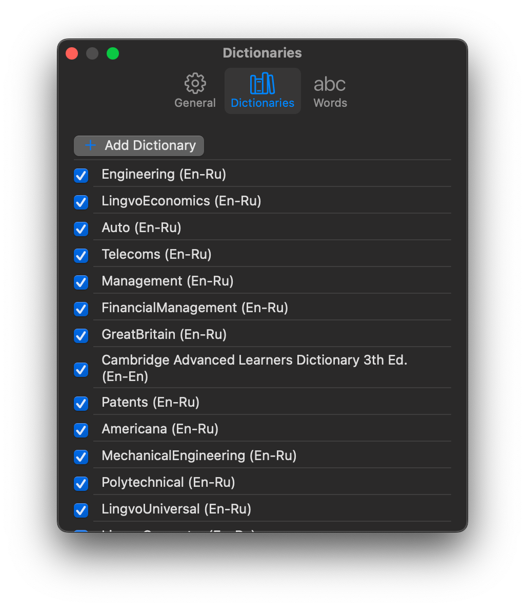

# Book Crammer — презентация closed-source проекта для резюме

Приложение с бэкендом, позволяющее загружать книги, открывать их содержание, просматривать редкие и неизвестные слова в каждой главе и получать о них справку из словарей.

## Скриншоты
### Настройки. Добавление, отключение и перестановка словарей

### Окно словаря

### Окно для чтения по главам

### Окно для чтения по главам и абзацам

